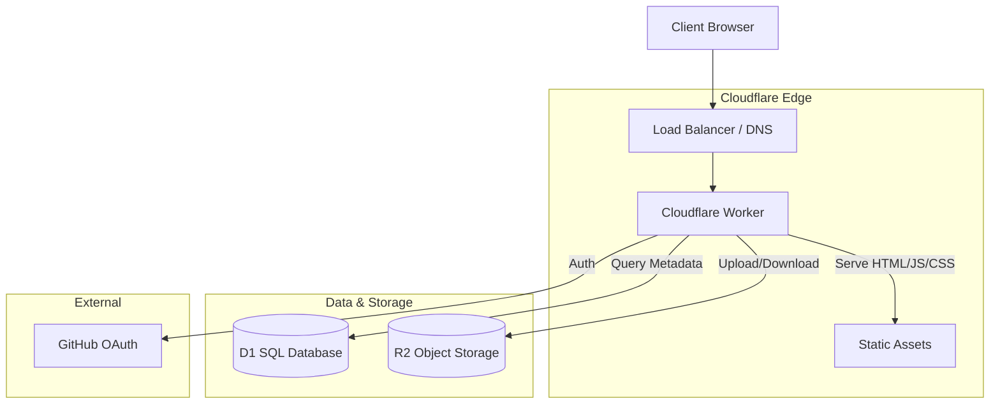
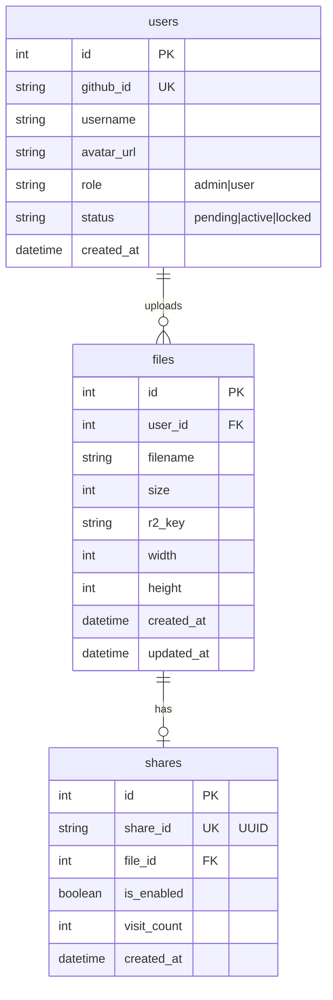

# SVGShare 技术设计文档 v1.1

## 1. 系统架构 (System Architecture)

SVGShare 采用全栈 Cloudflare 架构，利用 Edge 优势实现高性能和低延迟。前端无构建过程，直接部署于 Worker 静态资源中。



## 2. 数据库设计 (Database Design)

使用 Cloudflare D1 (SQLite) 存储关系型数据。

### ER Diagram



### Table Schema

```sql
-- Users Table
CREATE TABLE users (
    id INTEGER PRIMARY KEY AUTOINCREMENT,
    github_id TEXT UNIQUE NOT NULL,
    username TEXT NOT NULL,
    avatar_url TEXT,
    role TEXT DEFAULT 'user', -- 'admin' | 'user'
    status TEXT DEFAULT 'pending', -- 'pending' | 'active' | 'locked'
    storage_limit INTEGER DEFAULT 104857600, -- 100MB in bytes
    created_at DATETIME DEFAULT CURRENT_TIMESTAMP
);

-- Files Table
CREATE TABLE files (
    id INTEGER PRIMARY KEY AUTOINCREMENT,
    user_id INTEGER NOT NULL,
    filename TEXT NOT NULL,
    size INTEGER NOT NULL,
    r2_key TEXT NOT NULL,
    width INTEGER,
    height INTEGER,
    created_at DATETIME DEFAULT CURRENT_TIMESTAMP,
    updated_at DATETIME DEFAULT CURRENT_TIMESTAMP,
    FOREIGN KEY (user_id) REFERENCES users(id) ON DELETE CASCADE
);

-- Shares Table
CREATE TABLE shares (
    id INTEGER PRIMARY KEY AUTOINCREMENT,
    file_id INTEGER UNIQUE NOT NULL,
    share_id TEXT UNIQUE NOT NULL,
    is_enabled BOOLEAN DEFAULT 0,
    visit_count INTEGER DEFAULT 0,
    created_at DATETIME DEFAULT CURRENT_TIMESTAMP,
    FOREIGN KEY (file_id) REFERENCES files(id) ON DELETE CASCADE
);
```

## 3. 存储设计 (Storage Design - R2)

- **Bucket Policy**: Private (Public Access Disabled)。
- **Key Naming Strategy**: `files/{user_id}/{r2_key}.svg`
- **Access Pattern**:
    - **Upload**: Stream directly from Worker Request Body to R2 `put()`。
    - **Download (Private)**: `/api/files/:id/content` 需认证，用于 Dashboard 缩略图。
    - **Download (Public)**: `/raw/:share_id` 用于分享页渲染。

## 4. API 接口设计 (API Design)

| Method | Endpoint | Description | Auth |
| :--- | :--- | :--- | :--- |
| **Auth** | | | |
| GET | `/auth/login` | Redirect to GitHub OAuth | No |
| GET | `/auth/callback` | Exchange code, set Session Cookie | No |
| GET | `/auth/me` | Get current user info | Yes |
| POST | `/auth/logout` | Clear session & redirect | Yes |
| **Admin** | | | |
| GET | `/api/admin/users` | List users (w/ filters & usage) | Yes (Admin) |
| PATCH | `/api/admin/users/:id/status` | Update user status | Yes (Admin) |
| PATCH | `/api/admin/users/:id/quota` | Update user storage limit | Yes (Admin) |
| **Files** | | | |
| GET | `/api/files` | List my files | Yes |
| POST | `/api/files` | Upload new file | Yes |
| DELETE | `/api/files/:id` | Delete file & metadata | Yes |
| PATCH | `/api/files/:id` | Update filename | Yes |
| GET | `/api/files/:id/content` | Get SVG content (for thumbnail) | Yes |
| **Shares** | | | |
| POST | `/api/files/:id/share` | Toggle Share Link | Yes |
| **Public** | | | |
| GET | `/api/s/:share_id` | Get share metadata (filename etc) | No |
| GET | `/s/:share_id` | Render Share Page (HTML) | No |
| GET | `/raw/:share_id` | Get Raw SVG Content | No |

## 5. 前端设计 (Frontend Design)

采用原生 ESM 模块化开发，无构建步骤。

### Directory Structure

```text
/
├── src/
│   ├── worker.js       # Main Worker Entry
│   ├── auth.js         # OAuth Logic & Session
│   ├── db.js           # D1 Helpers
│   └── r2.js           # R2 Helpers
├── public/             # Static Assets
│   ├── index.html      # Landing Page
│   ├── dashboard.html  # User Dashboard
│   ├── admin.html      # Admin Dashboard (New)
│   ├── share.html      # Public Viewer Template
│   ├── css/
│   │   ├── reset.css
│   │   └── theme.css   # Design Tokens (Future Tech)
│   ├── js/
│       ├── dashboard.js
│       ├── admin.js        # Admin Logic (New)
│       ├── share.js
│       └── components/
│           ├── bento-grid.js   # Grid Layout Component
│           └── svg-viewer.js   # Pan/Zoom Viewer
├── schema.sql
└── wrangler.toml
```

### 关键组件

1.  **`svg-viewer.js`**:
    - 实现 `<svg-viewer src="...">` 自定义元素。
    - 使用 `fetch` 获取 SVG 内容，动态插入 Shadow DOM。
    - 实现 Pan & Zoom 逻辑 (Matrix Transform)。
    - **滚轮缩放因子**: 1.03 (平滑控制)。
    - **控件**: +/- 缩放按钮，↺ 重置按钮。
    - **安全**: 自动移除 `<script>` 和 `on*` 属性。

2.  **`bento-grid.js`**:
    - 使用 CSS Grid 实现响应式布局。
    - 卡片高度: 280px。
    - CSS 变量驱动样式 (`--bg-card`, `--border-subtle`, etc.)。

## 6. 设计系统 (Design System)

基于 `DesignPrinciples` 参考风格实现。

### CSS Variables (`theme.css`)

```css
:root {
  --bg-main: #0a0a0a;
  --bg-card: #111111;
  --bg-card-hover: #161616;
  --text-main: #ffffff;
  --text-muted: #888888;
  --accent: #FF3300;
  --border-subtle: rgba(255, 255, 255, 0.05);
  --border-glow: rgba(255, 51, 0, 0.3);
  --font-sans: 'Inter', sans-serif;
  --font-mono: 'JetBrains Mono', monospace;
  --radius-sm: 0px;
  --radius-md: 0px;
}
```

### Visual Effects

- **Noise Overlay**: SVG-based fractal noise at 3% opacity。
- **Scanline**: Horizontal lines at 4px spacing, 30% opacity。

## 7. 安全设计 (Security Design)

- **Session**: HttpOnly, Secure, SameSite=Lax Cookie 存储 JWT。
- **CORS**: 同源策略，无跨域需求。
- **Input Validation**: 校验文件 MIME Type (`image/svg+xml`) 、大小 (Max 2MB) 及用户剩余容量。
- **XSS Prevention**: SVG 渲染前移除 `<script>` 和 `on*` 事件。

## 8. 部署配置 (Deployment)

### wrangler.toml

```toml
name = "svgshare"
main = "src/worker.js"
compatibility_date = "2024-09-23"

[[d1_databases]]
binding = "DB"
database_name = "svgshare-db"
database_id = "<your-d1-id>"

[[r2_buckets]]
binding = "BUCKET"
bucket_name = "svgshare-files"

[assets]
directory = "./public"
binding = "ASSETS"
```

### Environment Variables (Secrets)

在 Cloudflare Dashboard 中设置，**不要**放在 `wrangler.toml` 的 `[vars]` 中：

- `GITHUB_CLIENT_ID`
- `GITHUB_CLIENT_SECRET`
- `JWT_SECRET`
- `ADMIN_GITHUB_IDS` (comma-separated list of GitHub IDs for initial admins)
